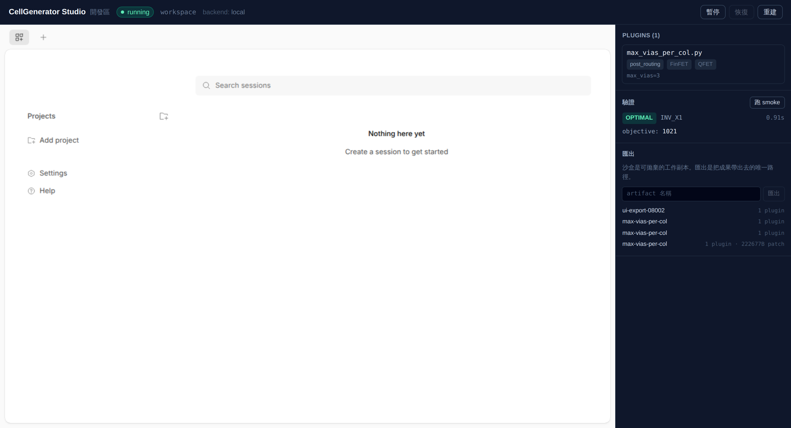
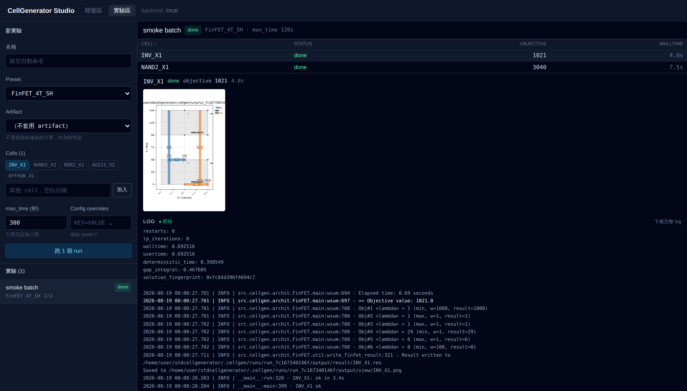

# CellGenerator Studio

用自然語言開發 standard-cell 的 place & route constraint,再把成果撒成批次實驗。

底層引擎是 UCSD 的 [SMTCellUCSD 2.0](engine/)（同步 place & route,求解器是 OR-Tools
CP-SAT——名字裡的 "SMT" 是歷史遺留)。這個專案在它外面包了兩層:

* **開發區(Tab 1)** — 一個可拋棄的沙盒,裡面跑 opencode。用自然語言寫 constraint、
  當場跑小測資驗證,再把成果匯出成 artifact。**MVP 已完成。**
* **實驗區(Tab 2)** — 匯入 artifact,對一批 cell 跑 CP-SAT,比對指標。**已完成。**

完整的設計與決策記錄在 [`docs/plan.md`](docs/plan.md)。

---

## 現在能跑什麼

後端與引擎已經可用,前端還沒開始。下面每張圖都是在這個 repo 當前 commit 上實際跑出來的。

| 元件 | 狀態 |
|---|---|
| `engine/` — CP-SAT 引擎、單一 CLI 入口、constraint plugin 層 | ✅ 可用 |
| `services/api/` — 沙盒生命週期、狀態快照、opencode 反向代理、artifact 匯出 | ✅ 可用 |
| `apps/web/` — Tab 1 前端 | ✅ 可用 |
| `services/worker/` — Celery worker、即時 log、取消 | ✅ 可用 |

測試:engine 68 passed、api 95 passed、worker 18 passed。

### 開發區(Tab 1)

```bash
uvicorn cellgen_api.main:app --port 8000 --app-dir services/api   # 後端
cd apps/web && npm install && npm run dev                          # 前端
```



左邊是 iframe 裝著沙盒的 opencode;右邊看得到 agent 寫出來的 plugin(顯示的是
manifest 實際生效的參數)、按一下就跑的 smoke 驗證,以及匯出。

### 實驗區(Tab 2)



挑一個 artifact 和幾顆 cell,每顆 cell 一個 run,各自解、各自可取消。log 是即時串流的。
**比較只看 objective 與 walltime**——同一個模型跑兩次,版面可能不同而成本相同。

### 引擎:一條指令解一顆 cell

```bash
cd engine
python -m src.cellgen.run --preset FinFET_4T_SH --cell INV_X1 --output-dir runs/demo
```


每次 run 都寫進自己的 `--output-dir`,不會互相覆蓋——這是原本 Makefile 流程做不到的。

### API:沙盒生命週期

```bash
pip install -e "services/api[dev]"
uvicorn cellgen_api.main:app --port 8000 --app-dir services/api
```


---

## 把引擎自己的 constraint 關掉

`GET /api/builtins` 列出引擎內建的 59 條 constraint。任何一條都能在實驗裡單獨停用:

```json
{ "builtins": ["placement.diffusion_alignment"] }
```

這是整個工具存在的理由——在此之前，要拿掉一條既有規則只能去改
`archit/<TECH>/main.py`，所以沒人量得出它到底買到了什麼。停用一條會讓模型少掉它那些
constraint(實測 `link_source_drain_gate_columns_to_transistor_placement` 少 200 條)。

什麼都不停用時，模型與改動前**完全相同**——這點有回歸測試釘住。

## 三個核心設計

**沙盒是可拋棄的工作副本。** 沙盒內的任何修改都碰不到上游 engine,也沒有 push 路徑。
工作離開沙盒的唯一途徑是匯出成 artifact:plugin 逐個抽出(實驗才能單獨開關、改參數),
其餘檔案編輯則以 unified diff 保存。

**狀態快照是每個 session 幾百 bytes,不是整個檔案系統。** 走 opencode 官方的
`export`/`import`,而不是複製 SQLite 檔。實測空 session 匯出 634 bytes,對照整個
data dir 是 308 KB。細節見 [`docs/opencode-state-spike.md`](docs/opencode-state-spike.md)。

**版面幾何不可重現,只能比指標。** 同樣設定連跑四次,objective 恆為 1021.0,但版面有
三種。`num_search_workers=1` 會被 model preset 蓋掉,`deterministic_solve=true` 也不管用。
所以實驗比對只比 objective / walltime 這類指標,不比版面。量測見
[`docs/solve-reproducibility.md`](docs/solve-reproducibility.md)。

---

## 上手

* **[部署與啟動](docs/deploy.md)** — 拉到自己環境要怎麼跑起來。有本機 opencode 就
  不需要 E2B。
* **[使用手冊](docs/manual.md)** — 從安裝到匯出 artifact 的完整流程,每步都有截圖。
* **[開發計劃](docs/plan.md)** — 架構、已確認的決策、各階段進度。
* **[寫一條 constraint plugin](engine/AGENTS.md)** — `@constraint` 介面、`inst` 上所有
  可用的變數字典、`lgg` API。這份文件由引擎原始碼自動產生,不要手改。

## Repo 結構

```
engine/                     # SMTCellUCSD 2.0 就地演進
  src/cellgen/run.py        #   單一 CLI 入口(取代 Makefile 兩步驟)
  src/cellgen/plugins/      #   constraint registry + loader + 五個掛點
  AGENTS.md                 #   自動產生的 constraint 撰寫指南
services/api/               # FastAPI:沙盒、快照、opencode 代理、artifact
docs/plan.md                # 開發計劃與進度
```
