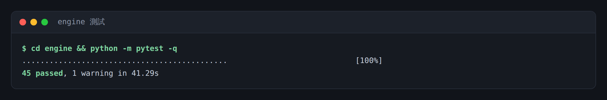
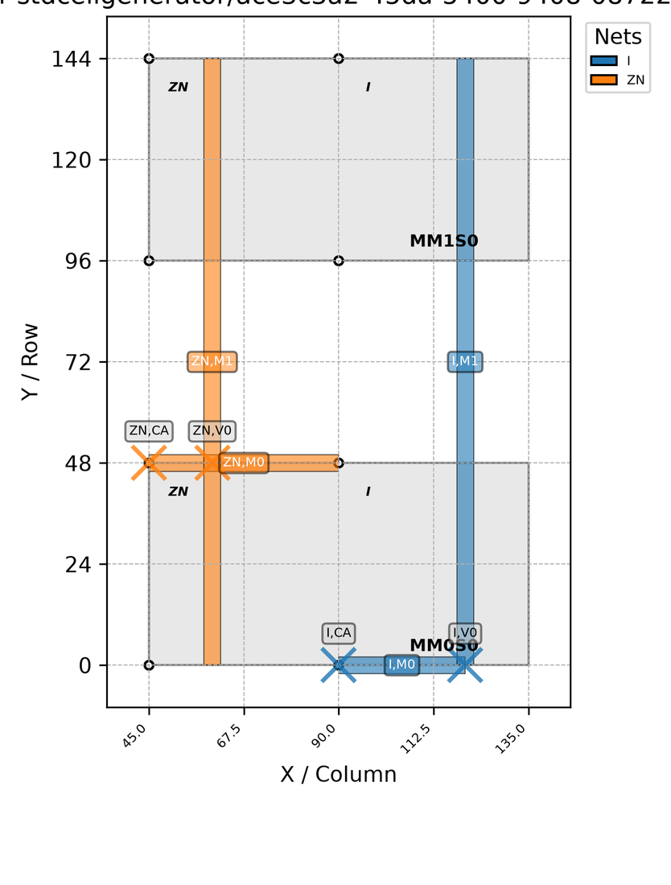
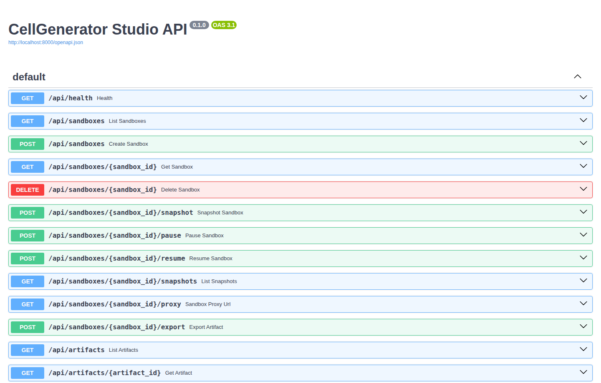
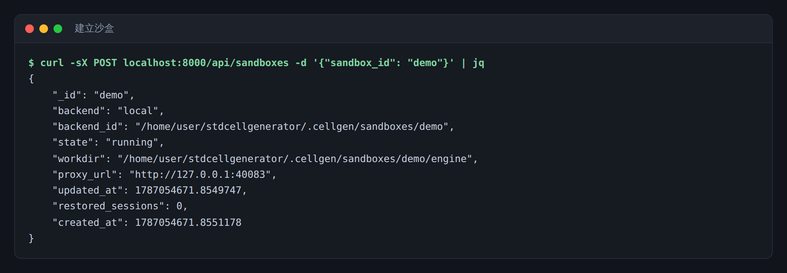
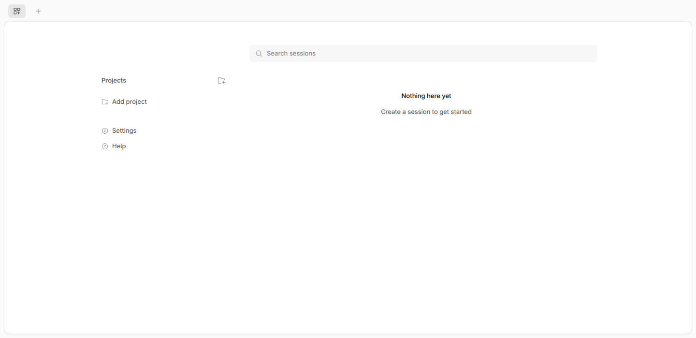
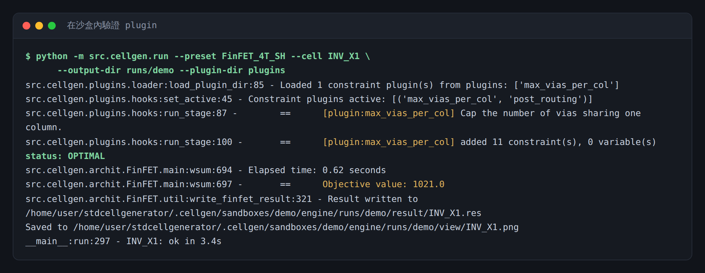
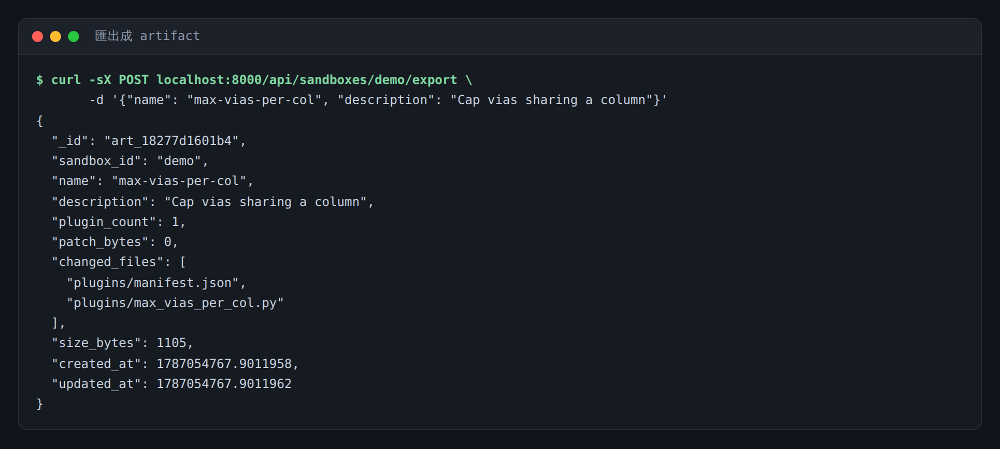
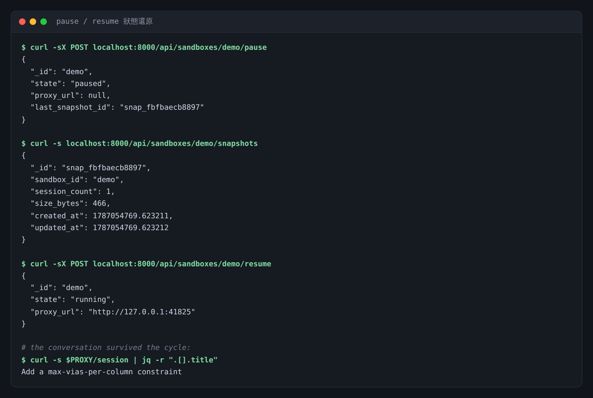

# 使用手冊

從零到「把一條 constraint 匯出成可跑實驗的 artifact」。

前端(Tab 1)還沒開始做,所以現在的操作介面是 CLI 與 HTTP API;文中每張截圖都是實際
跑出來的輸出。等 `apps/web/` 完成後,這些 API 呼叫會被按鈕取代,但流程本身不變。

**目錄**

1. [安裝](#1-安裝)
2. [跑一次 solve](#2-跑一次-solve)
3. [啟動 API](#3-啟動-api)
4. [開一個沙盒](#4-開一個沙盒)
5. [在沙盒內開發 constraint](#5-在沙盒內開發-constraint)
6. [匯出成 artifact](#6-匯出成-artifact)
7. [關掉再打開:狀態還原](#7-關掉再打開狀態還原)
8. [疑難排解](#8-疑難排解)

---

## 1. 安裝

需要 Python 3.11+、git,以及一個 opencode 執行檔。

```bash
pip install -e "engine[dev]"          # CP-SAT 引擎 + 測試工具
pip install -e "services/api[dev]"    # 後端 API
npm i -g opencode-ai@1.18.18          # 沙盒內的 agent
```

opencode 版本請鎖住。狀態還原走的是它的 `export` / `import`,這組介面與版本耦合;
升級後要重跑一次 round-trip 驗證(見 [`opencode-state-spike.md`](opencode-state-spike.md))。

先跑測試確認環境沒問題:

```bash
cd engine && python -m pytest -q
```



API 的測試需要 opencode 執行檔,沒有的話會乾淨地 skip:

```bash
cd services/api && CELLGEN_OPENCODE_BIN=$(which opencode) python -m pytest -q
```

---

## 2. 跑一次 solve

先確認引擎本身能動,再談沙盒。

```bash
cd engine
python -m src.cellgen.run --preset FinFET_4T_SH --cell INV_X1 --output-dir runs/demo
```

產出落在 `runs/demo/` 底下:

| 路徑 | 內容 |
|---|---|
| `result/INV_X1.res` | 解出來的版面(文字格式) |
| `result/INV_X1.var` | 完整變數指派 |
| `view/INV_X1.png` | 版面圖 |
| `logs/INV_X1.log` | 完整 solver log |
| `config/INV_X1.json` | 這次 run 實際用的 cell config |



**`--output-dir` 一定要每次不同。** 原本的 Makefile 流程用 `LIBNAME`/`HEIGHT` 決定輸出
路徑,兩次只差 seed 的 run 會蓋掉彼此。`runs/` 已經在 `.gitignore` 裡。

常用選項:

| 選項 | 用途 |
|---|---|
| `--list-cells` | 列出這個 preset 的 netlist 裡有哪些 cell |
| `--cell X --cell Y` | 一次解多顆 |
| `--override max_time.value=true --override max_time.time=60` | 蓋掉 cell config;**建議一定要設 `max_time`**,引擎預設是無限制 |
| `--plugin-dir plugins` | 載入 constraint plugin(見下) |
| `--flag-log-constraints` | 把每一條 CP-SAT constraint 印出來(可能超過 500 MB) |

> **求解時間不可預測。** 六顆電晶體的 CFET `AOI21_X2` 跑了 403 秒,DFF 可能數小時。
> `max_time` 和 `use_relative_gap` 是唯二能換迭代速度的旋鈕。

---

## 3. 啟動 API

```bash
CELLGEN_OPENCODE_BIN=$(which opencode) \
  uvicorn cellgen_api.main:app --port 8000 --app-dir services/api
```

開 <http://localhost:8000/docs> 看互動式 API 文件:



主要設定(全部可用環境變數覆蓋):

| 變數 | 預設 | 意義 |
|---|---|---|
| `CELLGEN_BACKEND` | `local` | `local`(子程序)或 `e2b`(遠端沙盒) |
| `CELLGEN_ENGINE_SRC` | `./engine` | 複製進沙盒的 engine checkout |
| `CELLGEN_DATA_ROOT` | `./.cellgen` | 沙盒工作目錄與檔案儲存 |
| `CELLGEN_OPENCODE_BIN` | PATH 上的 `opencode` | opencode 執行檔 |
| `CELLGEN_MONGO_URL` | 未設 | 設了就用 MongoDB,連不上會退回檔案儲存 |
| `E2B_API_KEY` | 未設 | `e2b` backend 必需 |

`local` backend 沒有隔離——plugin 是以當前使用者權限直接執行的,只適合本機開發。
但它跑的是跟 E2B 完全相同的狀態捕捉、代理與生命週期程式碼,所以沒有雲端憑證也能開發整層。

---

## 4. 開一個沙盒

```bash
curl -sX POST localhost:8000/api/sandboxes -d '{"sandbox_id": "demo"}'
```



發生了這些事:

1. `engine/` 被複製到 `.cellgen/sandboxes/demo/engine`(排除 `output/`、`.git`、`__pycache__`)。
2. 該目錄被 `git init` 並做一個 **baseline commit**——之後「這個沙盒改了什麼」就是對它的 diff。
   (opencode 也是靠 git worktree 認 project 的,沒有 repo 的話所有 session 會掉進
   catch-all 的 `global` project。)
3. opencode 以 `XDG_DATA_HOME` 指向沙盒自己的資料目錄啟動。
4. 一個反向代理在 `proxy_url` 上起來。

**`sandbox_id` 請固定重用。** opencode 用絕對工作目錄來界定 project,重建時路徑必須一模一樣,
還原的 session 才認得回去。用同一個 id 再 POST 一次是安全的——若沙盒還活著就直接回傳原本那個,
不會起第二份。

### 開啟 opencode

把瀏覽器指向回傳的 `proxy_url`(前端未來會用 iframe 裝這個):



> 截圖是空的工作區,因為這台機器沒有設定任何 model provider。要真的用自然語言開發,
> 沙盒內需要 provider key。

**為什麼要經過代理**:直接把 iframe 指向沙盒,等於把沙盒位址和伺服器密碼交給瀏覽器。
代理在伺服器端注入 basic auth,瀏覽器兩樣都拿不到;直接打沙盒會收到 401。

每個沙盒有自己的 **root** 代理埠,而不是掛在 API 底下的某個路徑——因為 opencode 的 UI
用 root-absolute 路徑載入資產(`/assets/index-*.js`),而且會自己打 `/api/*`,掛在子路徑
下每個資產都會 404,路由也會撞在一起。

---

## 5. 在沙盒內開發 constraint

實務上這步是在 opencode 裡用自然語言講出來的。它會照著
[`engine/AGENTS.md`](../engine/AGENTS.md)——由引擎原始碼自動產生的介面文件——寫檔案。

寫出來的東西長這樣,放在沙盒的 `plugins/`:

```python
"""Cap how many vias may share a single routing column."""

from src.cellgen.plugins import constraint


@constraint(
    id="max_vias_per_col",
    stage="post_routing",
    tech=["FinFET", "QFET"],
    params={"max_vias": 2},
    description="Cap the number of vias sharing one column.",
)
def max_vias_per_col(inst, params):
    cap = params["max_vias"]
    by_col: dict[int, list] = {}
    for (u, v), var in inst.edge_vars.items():
        if u[0] != v[0] and u[2] == v[2]:      # layer change, same column = via
            by_col.setdefault(u[2], []).append(var)
    for col, vias in by_col.items():
        inst.opt.Add(sum(vias) <= cap)
```

一個 plugin 就是一個檔案,註冊一個接收 solve orchestrator (`inst`) 和參數 dict 的函式,
透過 `inst.opt` 送出 CP-SAT constraint。五個掛點:`pre_placement`、`post_placement`、
`pre_routing`、`post_routing`、`pre_solve`。

同目錄放一份 `manifest.json` 決定哪些啟用、參數蓋成什麼:

```json
{
  "plugins": [
    {"id": "max_vias_per_col", "enabled": true, "params": {"max_vias": 3}}
  ]
}
```

沒有 manifest 的話,目錄裡找到的每個 plugin 都會跑。

### 當場驗證

```bash
cd .cellgen/sandboxes/demo/engine
python -m src.cellgen.run --preset FinFET_4T_SH --cell INV_X1 \
      --output-dir runs/demo --plugin-dir plugins
```



引擎會逐個 plugin 報告它實際加了幾條 CP-SAT constraint、幾個變數——上面這條加了 11 條、
0 個變數,結果仍是 `OPTIMAL`,objective 1021.0(跟沒有這條 plugin 時相同,因為
`max_vias: 3` 對這顆 cell 而言是鬆的)。

驗證 plugin 時**請比 objective,不要比版面**。同一組設定跑兩次,版面可能不同而 objective
相同——見 [`solve-reproducibility.md`](solve-reproducibility.md)。

---

## 6. 匯出成 artifact

沙盒不能 push,也碰不到上游 engine。工作離開沙盒的唯一路徑是匯出成檔案:

```bash
curl -sX POST localhost:8000/api/sandboxes/demo/export \
     -d '{"name": "max-vias-per-col", "description": "Cap vias sharing a column"}'
```



兩種改動用不同形式保存:

| 改動 | 形式 | 為什麼 |
|---|---|---|
| `plugins/*.py` + `manifest.json` | 逐個抽成結構化項目 | 實驗要能單獨開關、單獨改參數 |
| 其他任何檔案編輯(改 objective、改既有 constraint…) | 對 baseline commit 的 unified diff | plugin 表達不了,但不能默默丟掉 |

上面這次 `patch_bytes` 是 0,因為只加了 plugin,沒動別的檔案。

> `runs/` 已在 engine 的 `.gitignore` 裡,所以 solver 產出不會被掃進 patch。若你把
> `--output-dir` 指到別處,那些檔案會被當成你的修改一起匯出。

匯出的 artifact 之後由實驗端還原:乾淨的 engine checkout → `git apply` patch →
寫入 plugins 與 manifest → 跑 `python -m src.cellgen.run --plugin-dir <dir>`。

列出所有 artifact:

```bash
curl -s localhost:8000/api/artifacts
curl -s localhost:8000/api/artifacts/art_18277d1601b4   # 含完整原始碼與 patch
```

---

## 7. 關掉再打開:狀態還原

這是 MVP 的核心承諾:沙盒可以被回收,但下次打開必須完整還原歷史對話。

```bash
curl -sX POST localhost:8000/api/sandboxes/demo/pause
curl -sX POST localhost:8000/api/sandboxes/demo/resume
```



幾件值得注意的事:

* **pause 會先做快照再暫停。** 暫停的沙盒不是備份——誤刪、template 改版、配額問題都可能
  讓它消失。快照是丟了之後重建的依據。
* **快照很小。** 上面那份含一個 session 的快照是 466 bytes。它只隨對話長度成長,與 engine
  和依賴完全無關。
* **resume 後代理埠會變。** 沙盒位址在 pause/resume 之間會改變,所以代理是重建而不是沿用。
  前端每次都要重新問 `proxy_url`,不能記舊的。
* **對話活下來了。** 最後那行輸出就是還原後仍在的 session 標題。

沙盒**整個掉了**也能救——用同一個 `sandbox_id` 再 POST 一次,最近的快照會被自動放回去:

```bash
curl -sX DELETE localhost:8000/api/sandboxes/demo   # 快照預設保留
curl -sX POST localhost:8000/api/sandboxes -d '{"sandbox_id": "demo"}'
# → "restored_sessions": 1
```

要指定還原某一份快照就帶 `restore_from`:

```bash
curl -s localhost:8000/api/sandboxes/demo/snapshots
curl -sX POST localhost:8000/api/sandboxes \
     -d '{"sandbox_id": "demo", "restore_from": "snap_fbfbaecb8897"}'
```

---

## 8. 疑難排解

**沙盒起來是 `failed`。** 看 `.cellgen/sandboxes/<id>/opencode.log`。最常見的是
`CELLGEN_OPENCODE_BIN` 指到不存在的檔案,或那個埠已經被佔用(埠是由 sandbox id 推導的)。

**`/api/sandboxes/{id}/snapshot` 回 409。** 沙盒沒有在這個 API 程序裡跑。API 重啟後
不會自動接管既有沙盒——先 `POST /resume`。

**代理回 502。** 沙盒沒回應。`GET /api/sandboxes/{id}` 看 `healthy`,再 `POST /resume`。

**solve 一直不結束。** 引擎預設沒有時間上限。加
`--override max_time.value=true --override max_time.time=300`。

**plugin 沒有生效。** 確認 `--plugin-dir` 有指到,且 manifest 裡 `enabled` 為 true。
載入時會印出 `Loaded N constraint plugin(s)`,跑到掛點時會印 `[plugin:<id>] added N
constraint(s)`——兩行都沒有就是沒載到。

**加了 plugin 之後變 INFEASIBLE。** 那條 constraint 太緊。這是正常的失敗方式,呼叫端會存活;
放寬參數再試。

**CFET 吃不到寫在 `core/` 的新 constraint。** CFET 的 orchestrator 是分叉的,大部分
constraint 複製成了自己的 private method。plugin 的 `tech=[...]` 標註就是用來講清楚涵蓋範圍的。

---

## 接下來

前端(Phase 3)是擋在 MVP 前面的唯一一塊。之後是沙盒內的 MCP server(Phase 5),
讓 opencode 能直接呼叫 `run_smoke` / `describe_context` / `validate_constraint`
而不是自己猜。再往後是 Tab 2 實驗區。進度表在 [`plan.md`](plan.md)。
